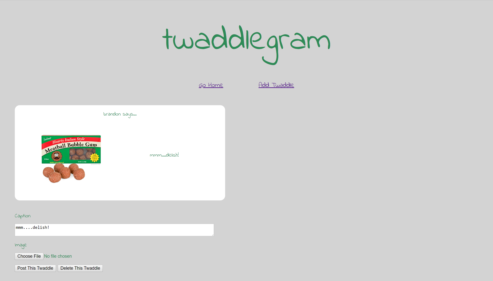

# TwaddleGram
https://twaddlegram.azurewebsites.net/
This simple (3 page) Razor Pages application emulates the basic features of a typical social media pages. A user can view, add, edit, and delete posts. A post can include a photo and a caption. Common navigation allows the user to return home or add a post from anywhere on the site.

## Build and Deployment
To build and deploy this page locally, do the following (assumes use of Visual Studio 2017):
 1. Clone this repo on your machine.
 2. This application uses User Secrets. Add the following connection string to your 'secrets.json':  
     "ProductionConnection": "Server=(localdb)\\MSSQLLocalDB;Database=TwaddleGram;Trusted_Connection=True;MultipleActiveResultSets=true"  
 3. To build and seed the database locally:
     - type 'Add-Migration new-build' in the 'Package Manager Console' and wait for the migration to complete
     - type 'Update-Database' in the 'Package Manager Console' and wait for the update to complete
 4.  Press 'F5' to run.

## In Use
The home page shows a card for each post containing the user's name, the photo, and the caption. The top nav bar (common to all pages) contains links to return home or to create a new post.

The 'add' page contains a form to allow a user to select his/her name ('add new users' feature not yet available), upload a photo, and type a caption.

The 'details' page shows a single post (on the same card), all comments associated with the post ('add comment' feature not yet available), and a link to make changes to the post.

The 'manage' page shows the same card as the 'details' page, and also a form to update the photo and/or caption. If a field is not updated, its original content is retained.

## Tools and Architecture
This application is built using ASP.NET Core MVC and Razor Pages. Razor Pages is preferable to a more traditional MVC structure for this app because the features and routes are simple enough as to not need full controllers. However, it still uses Entity Framework Core (ORM) to manage the data, and it implements dependency injection to allow data access and manipulation without direct coupling to the database.

The database schema is as follows:

The site consists of 3 total pages:  
The home page is a simple Razor View. It has the data model directly injected, and no additional routes (beyond 'GET').  
The 'details' and 'manage' pages are Razor Pages (ie - Razor Views with backing code). Their backing code implements service interfaces (repository design pattern), and the management services contain the DB context and all methods to access and manipulate the data. The 'manage' page is recycled for creating, editing, and deleting posts.

Simple data is stored in a SQL database. Uploaded images are stored in Azure Blob storage. The site is deployed in Azure, which is where all site storage resides.

## Testing
xUnit testing addresses all methods in Services.

